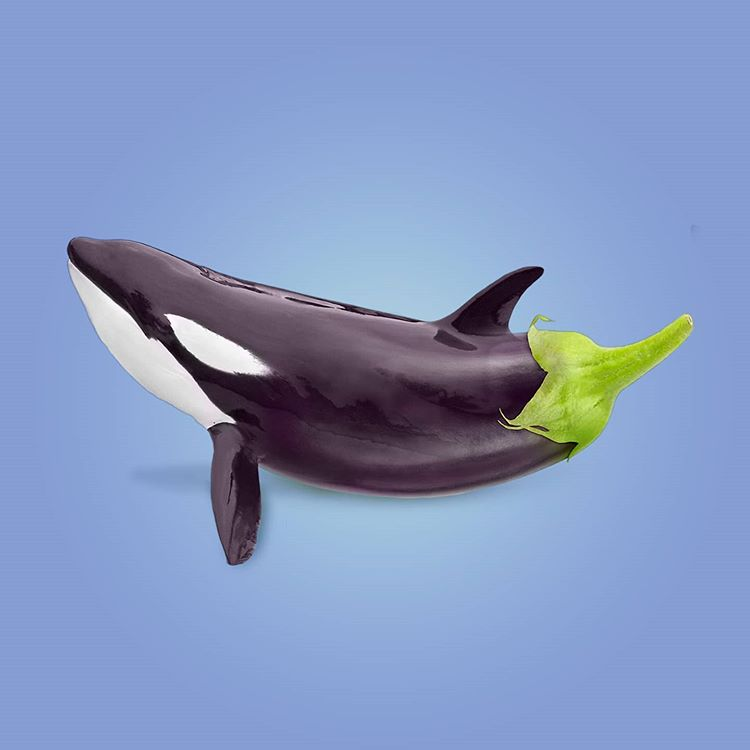
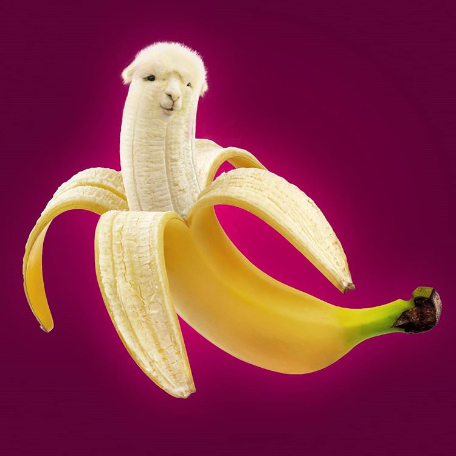
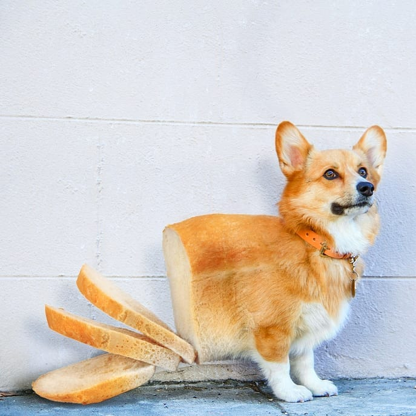
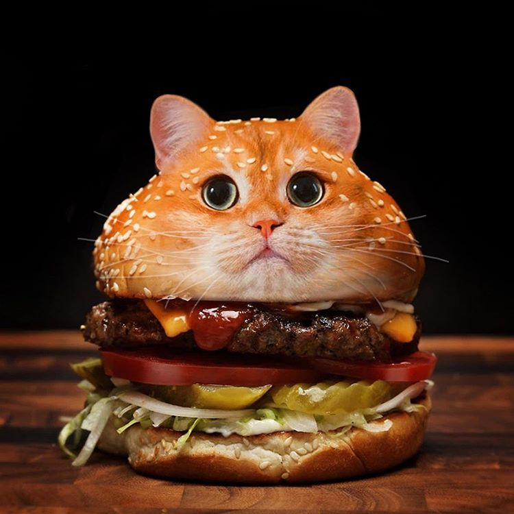
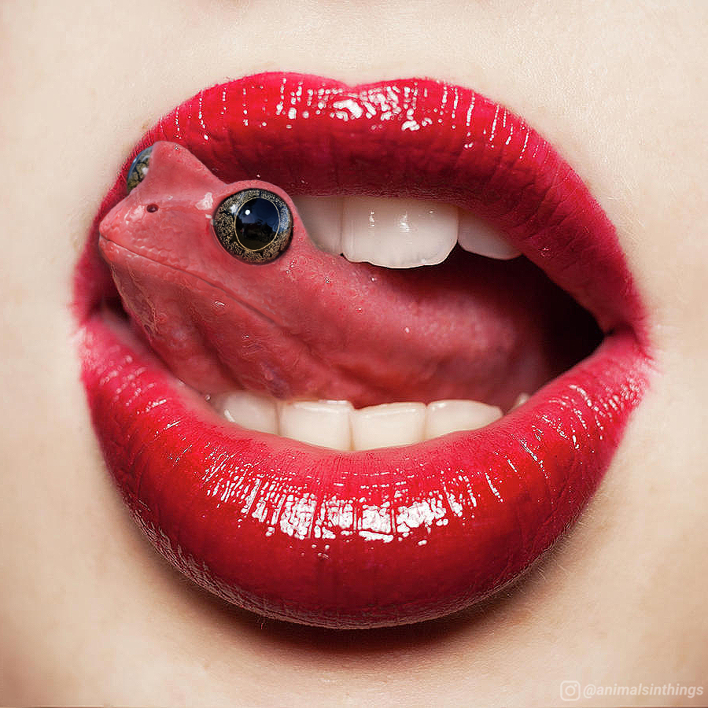
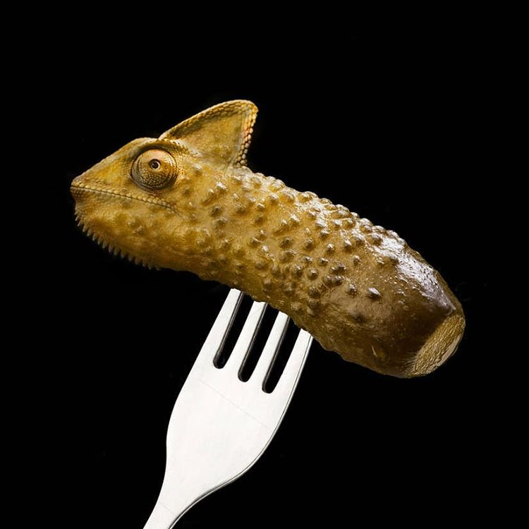
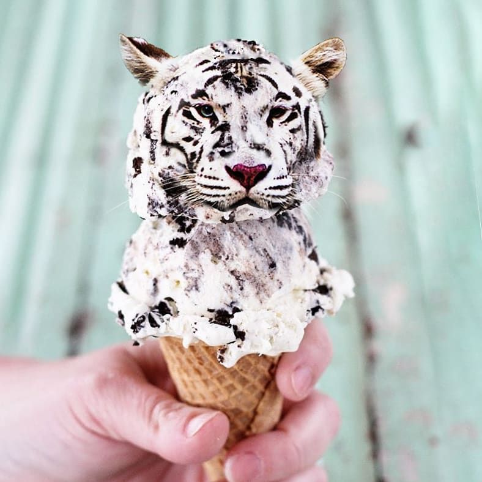
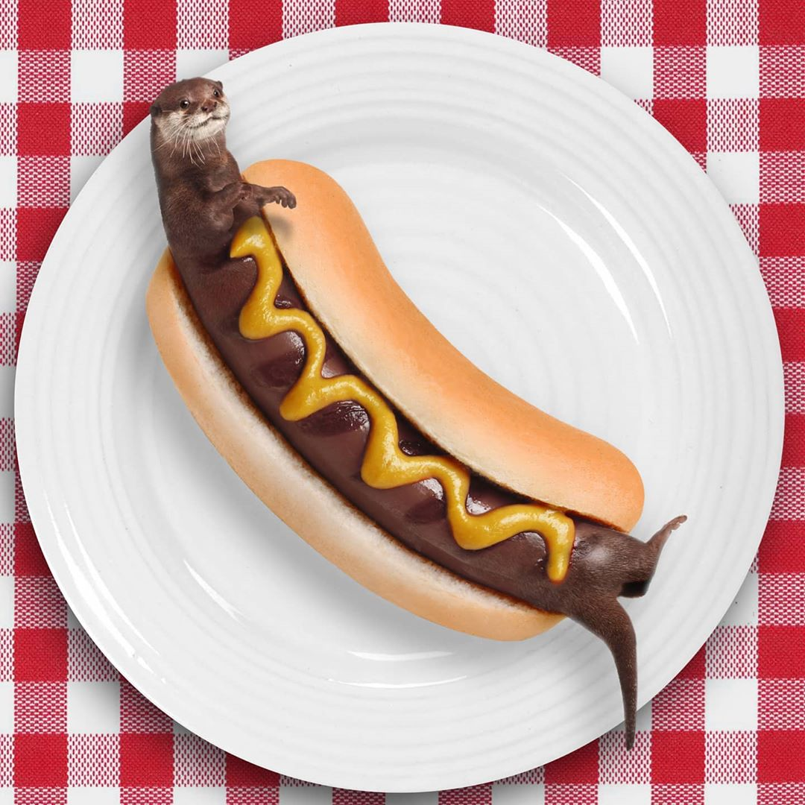

## OPDRACHT: Animal Things

### Introductie
De instagram gebruiker "animalinthings" maakt graag Photoshop werkjes waarbij hij een dier in een object verwerkt.

Voorbeelden kan je vinden als je naar beneden scrollt.

### Opdracht
We gaan dit nu ook doen. Neem je tijd om na te denken hoe je zoiets zou doen en zorg ervoor dat de overgang van "ding" naar "dier" realistisch is.

Kijk naar de voorbeelden als inspiratie. Maak gerust dezelfde idëeen aan maar gebruik nieuwe bronbestanden (en hou de originele bij)

**Upload deze oefening in het relevante uploadzone (naam zal Animal Things bevatten)**

### Bron Materiaal

Kies zelf welke dier je met welk ding wil combineren. Je kan in de map "animal things" bij de cursus enkele bron bestanden vinden voor "dingen". 

### Voorbeelden

