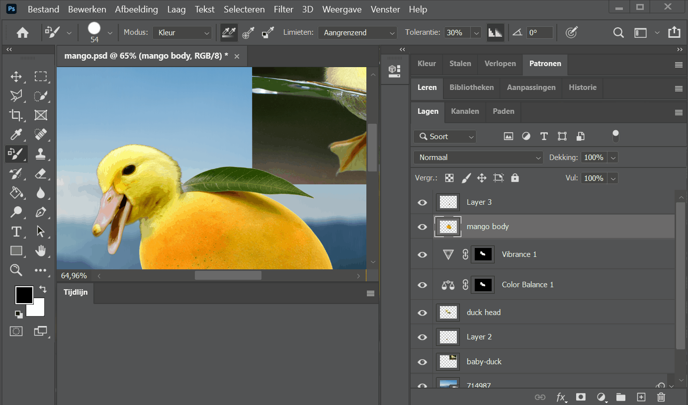
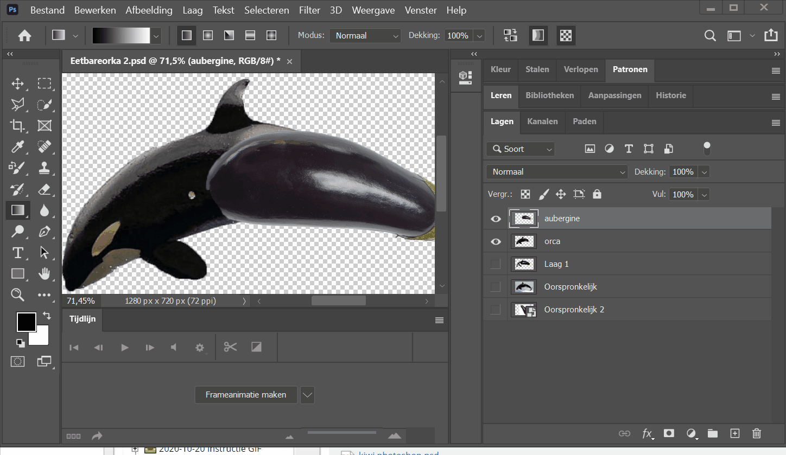
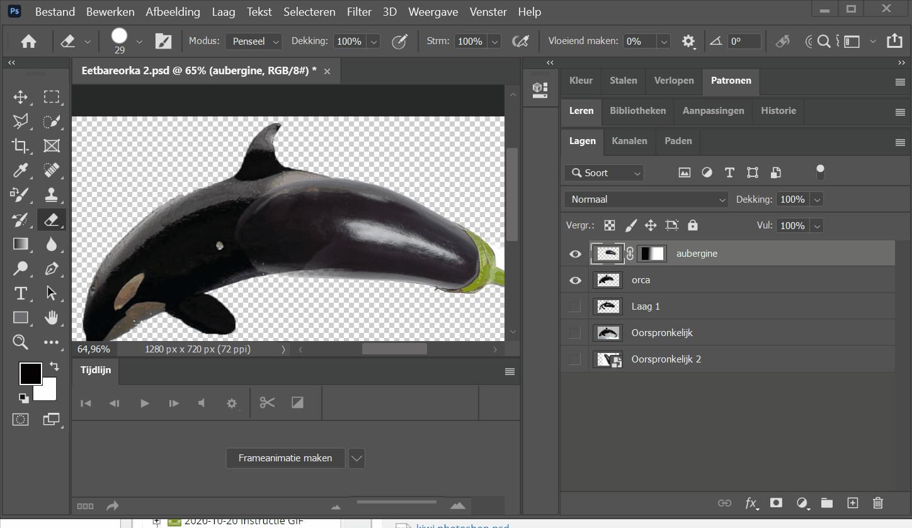

## OPDRACHT: Animal Things

### Introductie
De instagram gebruiker "animalinthings" maakt graag Photoshop werkjes waarbij hij een dier in een object verwerkt.

Voorbeelden kan je vinden als je naar beneden scrollt.

### Opdracht
We gaan dit nu ook doen. Neem je tijd om na te denken hoe je zoiets zou doen en zorg ervoor dat de overgang van "ding" naar "dier" realistisch is.

Kijk naar de voorbeelden als inspiratie. Maak gerust dezelfde idëeen aan maar gebruik nieuwe bronbestanden (en hou de originele bij).

**Upload deze oefening in het relevante uploadzone (naam zal Animal Things bevatten)**

Ik verwacht niet dat je van eerste keer de opdracht volledig goed kan maken. Ik zal je feedback geven en dan wordt je verwacht iets met die feedback te doen om je opdracht te verbeteren.

### Bron Materiaal

Kies zelf welke dier je met welk ding wil combineren. Je kan in de map "animal things" bij de cursus enkele bron bestanden vinden voor "dingen". 

Hierbij kopïeer ik ook nog eens enkele links die ik in les 4 al eens aangehaald heb:

Om foto's te vinden:

Zoekmachines:
https://www.bing.com/

https://www.google.be/imghp?hl=en&tab=wi&authuser=0&ogbl

probeer te letten op de resolutie: 1600 op 1400 is een goeie standaard

afbeeldingen zonder tekst of teveel bewerkingen

Goeie resources for stock photos (hoge resolutie)

Pexels - https://www.pexels.com/

Pixabay - https://pixabay.com/

Free Nature Stock - http://freenaturestock.com/ <<< VOOR DIEREN

Barn Images - https://barnimages.com/

Foodies Feed - https://www.foodiesfeed.com/

StockSnap - https://stocksnap.io/

### Technieken om te gebruiken

Probeer de op de belichting / kleuren te letten om het een zo realistisch mogelijke compositie te maken.
Je kan hier ondere andere volgende technieken die we gezien hebben in de klas:

- [Overvloeimodus / Blending modes](https://goldflow.github.io/photoshop-courses/les1/#4-overvloeimodus-blending-mode)
- [Kleur veranderen / aanpassen](https://goldflow.github.io/photoshop-courses/les4/#1-verkleuren)
- [Verloop Maskers (Mask Gradients)](https://github.com/Goldflow/photoshop-courses/tree/master/les1#53-masks-gradients)

Enkele voorbeelden van bovenstaande technieken:

#### Kleur veranderen
Zie [Kleur veranderen / aanpassen](https://goldflow.github.io/photoshop-courses/les4/#1-verkleuren).

Hiermee kan je het kleur aanpassen van ofwel je dier of je ding zodat het meer 1 geheel lijkt.

Door bijvoorbeeld hier de kleur van de mango te nemen, kunnen we dan de vacht van de eend dezelfde kleur geven.

#### Verloop Masker (mask gradient) toepassen
Zie [Verloop Maskers (Mask Gradients)](https://github.com/Goldflow/photoshop-courses/tree/master/les1#53-masks-gradients)

Om de overgang tussen twee gelijkaardige objecten subtieler te maken, kan je een verloop masker (mask gradient) toepassen zoals hieronder.

Daarna kan je de laag die je wil bijwerken door het gommetje/gummetje te gebruiken (eraser tool) om het nog beter af te werken:

### Voorbeelden

