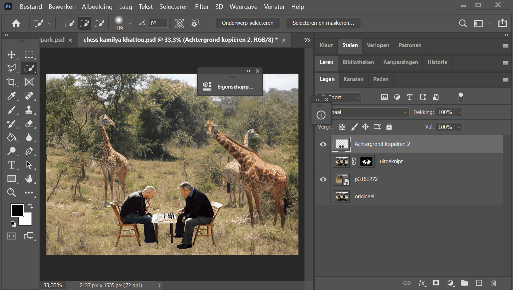
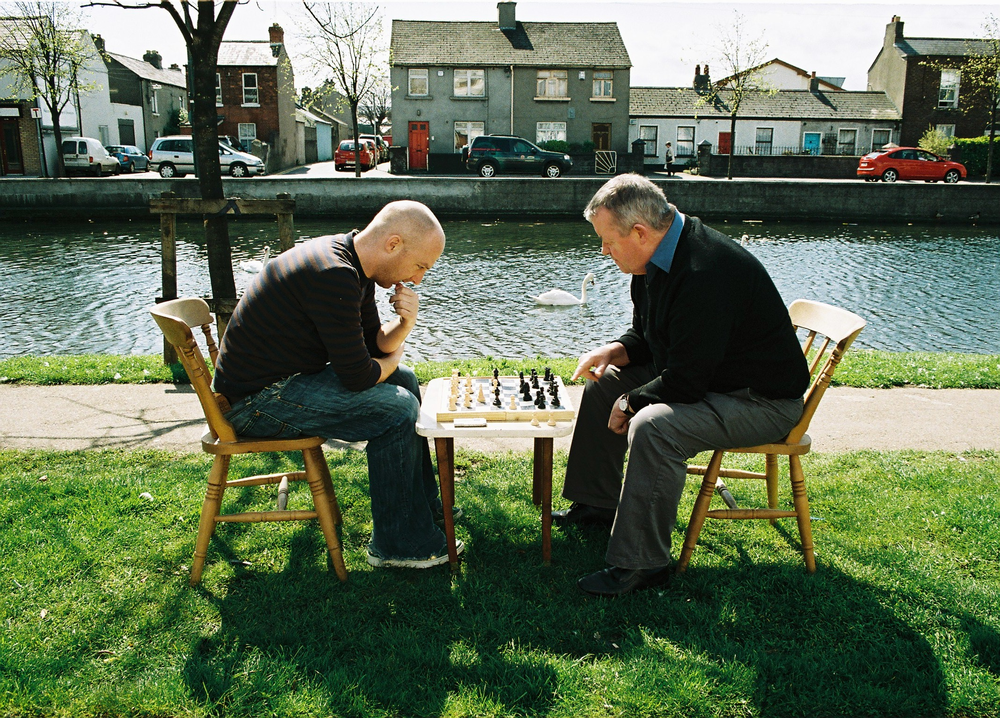

## OPDRACHT: Onverstoord Schaken

### Introductie

Voor deze opdracht vraag ik dat je aantoont dat hun concentratie niet gebroken kan worden door afleidingen / gebeurtenissen of dat deze kalme situatie op het punt staat te veranderen. 

### Opdracht omschrijving:

Ik wil dat je ze uitknipt en in een nieuwe situatie zet die er realistisch uitziet. Laat je verbeelding de vrije loop. Probeer bij het opzoeken van nieuwe foto's te denken aan de schaal. Je kan natuurlijk de mannen ook verschalen zoals het past met je nieuwe foto's maar probeer te letten op realisme.

**Upload deze oefening in het relevante uploadzone (naam zal Onverstoord Schaken bevatten)**

Eisen:

- knip de 2 mannen met schaakbord zo goed mogelijk uit
- gebruik minstens 1 andere foto om ze in een nieuwe omgeving plaats te zetten
- probeer te letten op kleuren zodat het realistisch lijkt (gebruik Afbeelding > Automatisch Tinten/Kleuren/Contrast)

### Technieken om te gebruiken

Probeer de op de belichting / kleuren te letten om het een zo realistisch mogelijke compositie te maken.
Je kan hier ondere andere volgende technieken die we gezien hebben in de klas:

- [Kleur veranderen / aanpassen](https://goldflow.github.io/photoshop-courses/les4/#1-verkleuren)
- [Overvloeimodus / Blending modes](https://goldflow.github.io/photoshop-courses/les1/#4-overvloeimodus-blending-mode)

#### Kleurtoon aanpassen

Er zijn veel verschillende technieken die toegepast kunnen worden om de schakers te plaatsen in een omgeving die realistisch blijft.
Hiervoor kan je bijvoorbeeld kleurtoon/verzadiging aanpassen van de schakers, door die eerst te selecteren (zie onderstaande gif).

- ZEER BELANGRIJK > het is de bedoeling dat je de achtergrond kleur behoud zoals ze is, maar enkel de schakers aanpast van kleur
- om enkel de schakers aan te passen, moet je die EERST SELECTEREN voor je kleurtoon/verzading aanpast (zie voorbeeld hieronder)

### Idëeen
Gebruik liefst van al je eigen idëeen maar als je inspiratie nodig hebt:

- ze schaken in het midden van iets heel dynamiek (sportwedstrijd)
- ze zitten in het midden van een geweld conflict
- er gaat iets of iemand in volle snelheid tegen hen botsen
- er staat op het punt iets te vallen op hen

[download de afbeelding](chess-park-focus/chess_park.jpg)
