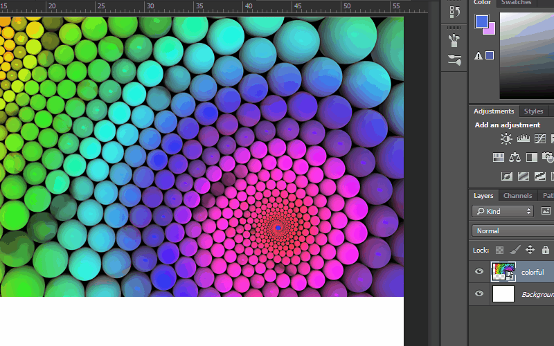

- [Photoshop Les 2](#photoshop-les-2)
  * [1. Herhalingsoefeningen](#1-herhalingsoefeningen)
    + [1.1 Spotify Effect](#11-spotify-effect)
    + [1.2 Gradient Effect](#12-gradient-effect)
    + [1.3 Afbeeldingen opzoeken & gebruiken](#13-afbeeldingen-opzoeken---gebruiken)
      - [Zoekmachines:](#zoekmachines-)
    + [1.4 Color Picker oefening](#14-color-picker-oefening)
      - [extra uitdagingen for Color Picker oefening:](#extra-uitdagingen-for-color-picker-oefening-)
      - [na afloop:](#na-afloop-)
  * [2. Tekst](#2-tekst)
    + [2.1 Lettertypes installeren](#21-lettertypes-installeren)
      - [Waar vind je gratis fonts?](#waar-vind-je-gratis-fonts-)
      - [Premium / Betalende fonts](#premium---betalende-fonts)
      - [Op zoek naar een font?](#op-zoek-naar-een-font-)
    + [2.2 Tekst op een pad](#22-tekst-op-een-pad)
    + [2.3 Tekst in een pad](#23-tekst-in-een-pad)
    + [3. De Shape Tool](#3-de-shape-tool)
    
---

# Photoshop Les 2

## 1. Herhalingsoefeningen

### 1.1 Spotify Effect

[http://www.wearecollins.com/work/spotify/](http://www.wearecollins.com/work/spotify/)

- Maak nieuw bestand (1600px op 1400px)
- Plaats de afbeelding MIA.jpg in het midden
- Selecteer de laag met de afbeelding van MIA en maak een nieuwe adjustment layer.(via layer panel of via menu layer > new adjustment layer)
- Kies voor Brightness / Contrast
- Geef het contrast een value van 90

- Maak een nieuwe layer en geef deze een felgroene achtergrond kleur of de hexadecimale waarde van #00ff36 (Voorgrond kleur selecteren en dan laag opvullen via shortcut alt + delete / backspace). En selecteer de blending mode "multiply".

- Maak nog een nieuwe layer maar gebruik deze keer een donkere kleur bvb. #23278a. Kies voor deze laag de blending mode "lighten"

- Werk de donkere randen rond de afbeelding van MIA weg. Dit doe je door een layer mask te maken. En vervolgens met een zwarte brush tool over de zwarte randen te gaan.

- Voeg 2 cirkels toe aan de afbeelding om het wat dynamisch te maken.

- Voeg het logo van Spotify (spotify_logo.png) toe. En geef deze een witte overlay kleur (via add layer style > color overlay > kies witte kleur).

### 1.2 Gradient Effect

- Maak nieuw bestand van 1600px op 1400px (ctrl + n)
- Plaats MIA.jpg in het midden van de file
- Selecteer de laag met de afbeelding van MIA en maak een nieuwe adjustment layer > brightness / contrast
- Breng het contrast van de afbeelding een beetje naar omhoog

- Maak een nieuwe laag (ctrl + shift + n)
- Selecteer een donker paarse voorgrondkleur en een lichtroze achtergrondkleur.
- Selecteer de linear gradient tool en vul de laag op met het gradient (van boven naar onder).

- Selecteer de laag met de gradient en selecteer de blending mode "lighten". Pas eventueel de opacity van de laag aan.
- Werk de donkere randen van de MIA afbeelding weg, dit doe je via een layer mask en de brush tool (zwarte brush).

### 1.3 Afbeeldingen opzoeken & gebruiken
#### Zoekmachines:
- [https://www.bing.com/](https://www.bing.com/ "https://www.bing.com/")
- [https://www.google.be/imghp?hl=en&tab=wi&authuser=0&ogbl](https://www.google.be/imghp?hl=en&tab=wi&authuser=0&ogbl "https://www.google.be/imghp")

- probeer te letten op de resolutie: 1600 op 1400 is een goeie standaard
- afbeeldingen zonder tekst of teveel bewerkingen

Goeie resources for stock photos:

Pexels - [https://www.pexels.com/](https://www.pexels.com/)

Pixabay - [https://pixabay.com/](https://pixabay.com/)

Free Nature Stock - http://freenaturestock.com/

Barn Images - https://barnimages.com/

Foodies Feed - https://www.foodiesfeed.com/

StockSnap - https://stocksnap.io/

### 1.4 Color Picker oefening

- Maak nieuw bestand van 1600px op 1400px (ctrl + n)
- Plaats colorful.jpg in het midden van de file

- Met de colorpicker kan je een kleur kiezen uit een bestaand bestand
- Zoek een afbeelding van een persoon in hoge kwaliteit, iets rond 1600x1400 (mag iets minder/meer zijn)
- Maak nu oefening 1.2 opnieuw zelfstandig maar gebruik deze keer een zelfgekozen zwart wit bestand
- 
#### extra uitdagingen for Color Picker oefening:
- doe hetzelfde nog op zijn minst 1 keer in hetzelfde bestand, en probeer een leuke compositie te vinden

#### na afloop:
- sla deze compositie op als colorpicker_voornaam_naam_2020-09-22.psd en upload deze

## 2. Tekst

Om tekst toe te voegen aan jouw photoshop file gebruik je de type tool.
Deze vind je terug in de gereedschappen panel of kan je selecteren via de shortcut "t".

Als je via de gereedschappen panel op de T drukt, zie je dat er een extra menu uitkomt. Daarin zie je dat je zowel horizontal als verticale tekst kan invoegen.

Selecteer de horizontale type tool.
Vervolgens zijn er 2 manier om tekst toe te voegen aan je document.

1) Je klikt gewoon met de cursor op de gewenste plaats en typ / plak je tekst. Deze methode heet point-type.

2) De tweede methode is om met de type tool een gebied te selecteren en dan je tekst typen / plakken. Deze manier heet Area type en dit is ook meteen de beste manier.

Als je tevreden bent met de tekst klik je op het groen vinkje de optie menu bovenaan.

In de optie menu balk (dit menu verandert naargelang de tool / gereedschap je selecteert) kan je ook de font-family (lettertype) aanpassen en de grootte van het lettertype alsook de tekststijl (bold, italic, light, regular), de tekstuitlijning (link, centreren,rechts) en de kleur van de tekst.

In de optie menu balk vind je al een groot deel van de opties voor tekst.
Je kan nog veel meer opties bekijken via het character / paragraph panel. Deze panel kun je openen via het icoontje uiterst rechts in de optie menu balk.

Via dit menu kan je de tekst in hoofdletters / all caps omzetten of kan je de kerning (afstand tussen de karakters) van de tekst aanpassen. Via dit menu kan je ook bijvoorbeeld tekst omzetten naar upperscript of subscript...

### 2.1 Lettertypes installeren

In photoshop kan je al een heleboel lettertypes vinden die al geïnstalleerd staan op jouw computer. Maar meestal ga je gebruik willen maken van een font die nog niet op jouw computer geïnstalleerd staat.

#### Waar vind je gratis fonts?

1. Google Fonts is wellicht de belangrijkste bron voor fonts. Het voordeel van Google Fonts is dat ze ook heel webvriendelijk zijn en dus heel makkelijk te integreren zijn in HTML en CSS.
[https://fonts.google.com/](https://fonts.google.com/)

2. Font Squirrel
Op font squirrel vind je ook heel wat mooie gratis fonts.
[https://www.fontsquirrel.com/](https://www.fontsquirrel.com/)

3. Typekit
Typekit maakt deel uit van Adobe CC. Als je dus een abonnement hebt op Adobe CC dan kan je gebruik maken van Typekit.
Via Typekit kan je makkelijk fonts toevoegen aan Photoshop.

Dit doe je op de volgende manier:

#### Premium / Betalende fonts

1. Hoefler & Co
http://www.typography.com/

#### Op zoek naar een font?

1. What The Font:
Heb je een font gezien die je graag zou gebruiken maar je weet de naam niet? Via What The Font kan je d.m.v. een foto de naam van het lettertype te weten komen.
[https://www.myfonts.com/WhatTheFont/](https://www.myfonts.com/WhatTheFont/)

2. Font Ninja:
Font Ninja is een extensie beschikbaar voor Chrome, Firefox en Safari. Aan de hand van deze extensie kan je achterhalen welke fonts er gebruikt werden op een bepaalde website.
[http://fontface.ninja/](http://fontface.ninja/)

### 2.2 Tekst op een pad

Soms moet je tekst typen op een vorm zoals een cirkel, vierkant, driehoek of op een complexere vorm. Dit kan je doen door tekst te typen op een pad.

Dit doe je op de volgende manier:
- Teken een vorm (cirkel, vierkant of iets anders).
- Selecteer de type tool via de shortcut "t" of selecteer hem via het gereedschapspanel
- Hover met de teksttool over de rand van de vorm (je zal zien dat de cursor verandert) en klik om de tekst te typen

### 2.3 Tekst in een pad

Uiteraard kunnen we ook tekst in een pad plaatsen

Dit doe je op een gelijkaardige manier:
- Teken een vorm
- Selecteer de typetool
- Klik met de cursor in het pad / vorm en begin te typen

### 3. De Shape Tool

Als je blijft klikken op de shape tool zal je zien dat er een extra menu uitklapt.
De shape tool heeft de volgende opties:
- Rectangle tool (rechthoek)
- Rounded Rectangle tool (rechthoek met ronde randen)
- Ellipse tool (ovaal /cirkel)
- Polygon tool
- Line tool
- Custom Shape Tool

Om een vorm te maken selecteer je de shape tool naar keuze en sleep je de vorm op het artboard. Je kan de vorm een fill color (of een gradiënt) en een border color geven (de border style kan je ook aanpassen). Let op deze opties zoals fill color zijn alleen zichtbaar als de shape tool en de juiste layer is geselecteerd.

Je kan vormen ook samenvoegen, van elkaar aftrekken, etc.
Dit doe je via het volgende incoontje in de optie menubar.

Achteraf kunnen we uiteraard ook de vorm aanpassen met de direct select tool

Naast de traditionele vormen kan je in Photoshop ook kiezen voor de custom shape tool. De vorm kan je kiezen in de optie menu bar.

Uit dit menu kan je nog meer vormen kiezen, dit doe je door te klikken op het tandwiel icoontje. Daarna kan je een categorie kiezen en worden de vormen ingeladen.

