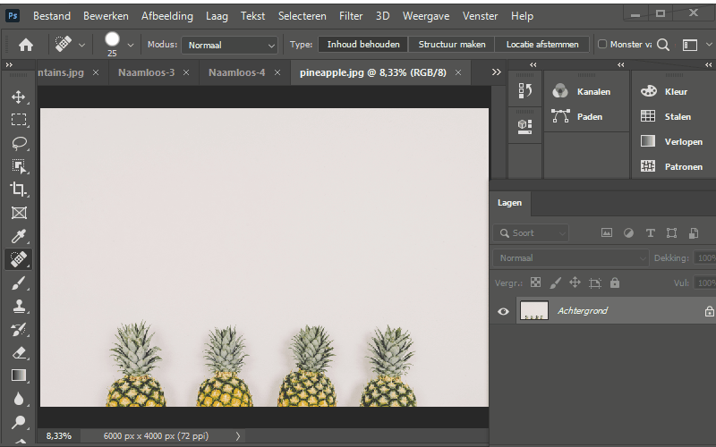
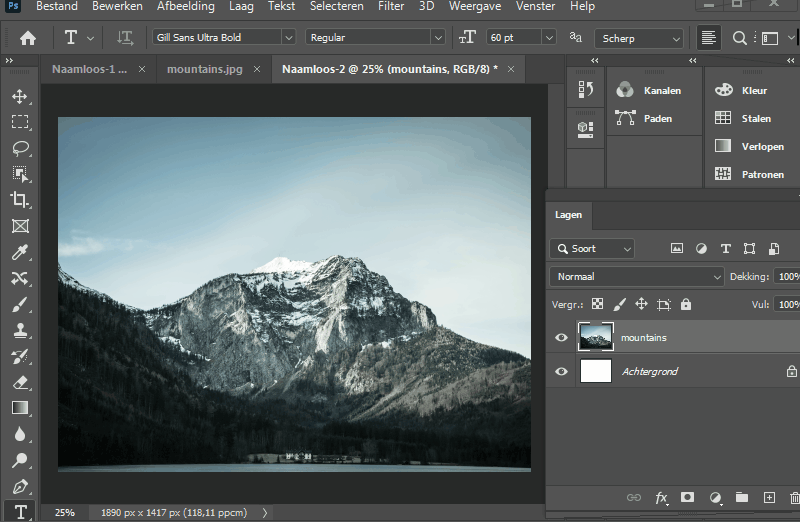

- [Photoshop Les 3](#photoshop-les-3)
  * [0. Afbeelding importeren](#0-afbeelding-importeren)
  * [1. Oefening](#1-oefening)
  * [2. Resources voor Typografie](#2-resources-voor-typografie)
  * [3. Inhoud Bewaren Tool - (Content Aware)](#3-inhoud-bewaren-tool-en-retoucheren)
    + [3.1 Een element uit een foto verwijderen](#31-een-element-uit-een-foto-verwijderen)
      - [Opdracht](#opdracht)
    + [3.2 Snel Retoucheer Penseel (Spot Healing Brush Tool)](#32-snel-retoucheer-penseel--spot-healing-brush-tool-)
    + [3.3 De Verplaatsen met behoud van inhoud tool ( Content aware move tool )](#33-de-verplaatsen-met-behoud-van-inhoud-tool---content-aware-move-tool--)
  * [4. Uitknip Maskers (Clipping masks)](#4-uitknip-maskers)
    + [4.1 Uitknip Masker met tekst](#41-uitknip-masker-met-tekst)
    + [4.2 Uitknip Masker met vormen](#42-uitknip-masker-met-vormen)
  * [5. Colors / Kleuren veranderen in Photoshop](#5-kleuren-veranderen-in-photoshop)
  * [6. Resources / Inspiratie voor (web) Designers en Developers](#6-resources-inspiratie-voor-designers-en-developers)
  * [7. Film Poster opdracht](#7-film-poster-opdracht)

  ---

# Photoshop Les 3

## 0. Afbeelding importeren

Als je wil gewoon je afbeelding wil importeren, sleep je die in de canvas.

Als je wil dat je photoshop een nieuw document maak in dezelfde exacte resolutie van je afbeelding, moet je je afbeelding in de layers laag slepen.

Voorbeeld van beide mogelijkheden staan hieronder in de gif.

## 1. Oefening

Blur oefening:
De achtergrond vervagen en een persoon of een voorwerp scherp houden.

- Open blur.jpg in Photoshop
- Dupliceer de background als nieuwe layer
- Geef de 2 layers een gepaste naam
- Pas de filter "Vervagen" (blur) > "Gaussiaans vervagen" (gaussian blur) toe op de bovenste laag

- De afbeelding mag goed wazig (blur) zijn, dus geef deze een value van ongeveer 70. En klik op OK.

- Maak nu een laagmasker (layer mask) op de wazige laag en gebruik de brush (zwart!) om de wazige laag te verwijderen op de persoon en zo de persoon terug scherp te maken.

## 2. Resources voor Typografie
In vorige les reeds enkele resources voor fonts meegegeven, o.a.: waar je lettertypes kunnen vinden en downloaden (google fonts, font-squirrel, etc.).

In het begin is het niet altijd evident om mooie / gebruiksvriendelijke fonts te kiezen.

Hier zijn enkele lips om daar nog meer over te leren

- [Learn typography in 10 minutes](http://practicaltypography.com/typography-in-ten-minutes.html)
- [Typography Guide](http://www.typogui.de/)
- [OpenFoundry](http://open-foundry.com/)
- [A beginners guide to pairing fonts](http://webdesign.tutsplus.com/articles/a-beginners-guide-to-pairing-fonts--webdesign-5706)
- [A beginners guide to pairing fonts](http://webdesign.tutsplus.com/articles/a-beginners-guide-to-pairing-fonts--webdesign-5706)
- [I love typography](http://ilovetypography.com/)
- [Font combination](https://www.canva.com/font-combinations/)
- [Font pair](http://fontpair.co/)
- [Font wolf](https://www.typewolf.com/)

## 3. Inhoud Bewaren Tool en Retoucheren

Via de Inhoud Bewaren tool (Content aware tool) kan je objecten uit een foto halen / verplaatsen.
Vaak voelt de Inhoud Bewaren tool aan als een beetje magie. Maar in veel gevallen levert de Inhoud Bewaren tool niet altijd een perfect resultaat op.

### 3.1 Een element uit een foto verwijderen

- Open flower.jpg met Photoshop
- Maak een vlugge selectie rond de bloem a.d.h.v. de lasso tool
- Zorg ervoor dat de selectie eindigt bij het beginpunt van de selectie zodat je een stippellijn te zien krijgt.

- Klik vervolgens op rechtermuisknop en druk op "Vullen"
- Vervolgens krijg je een pop-up venster te zien.
- Zorg ervoor dat "Inhoud Bewaren" geselecteerd staat en de optie "Kleur Adaptatie" aangevinkt staat.
- Kies voor ok

#### Opdracht
smartschool.PNG

neem het bestand smartschool en doe oefening 3.1

- verwijder de zeppelin & het bord "zoek een job bij smartschool"

- bonus punten voor de mensen die de zeppelin in het gras kunnen plaatsen zonder het blauw errond

verwijder_persoon

zoek een foto van 1 of meerdere personen en probeer die persoon eruit te kruigen

### 3.2 Snel Retoucheer Penseel (Spot Healing Brush Tool)

Het Snel Retoucheer Penseel kan gebruik worden om foto's te retoucheren.
De spot healing kan bijvoorbeeld gebruikt worden om oneffenheden (zoals puistjes) bij personen weg te werken.

- Open acne.jpg
- Selecteer het Snel Retoucheer Penseel (in het gereedschapspanel boven de brush tool)
- Klik en sleep over de puistjes en laat los
- Net zoals de klassieke brush tool kan je ook de healing brush tool van grootte aanpassen, dit doe je via het menu vanboven.

Het Snel Retoucheer Penseel kan niet enkel worden gebruikt om oneffenheden bij personen weg te werken.
Maar kan bijvoorbeeld ook gebruikt worden om een storende elektriciteitskabel uit een foto te halen.

- Open house.jpg
- Selecteer opnieuw het Snel Retoucheer Penseel.
- En verwijder de kabel op de achtergrond. En andere oneffenheden...

### 3.3 De Verplaatsen met behoud van inhoud tool ( Content aware move tool )

- Open pineapple.jpg
- Selecteer de Verplaatsen met behoud van inhoud tool uit het gereedschapspanel
- Maak een selectie rond een ananas (zorg ervoor dat je de schaduw rond de ananas ook meeneemt)

- Verplaats de selectie naar de gewenste Plaats
- Bevestig door enter te drukken of door op het vinkje vanboven in het menu te klikken

## 4. Uitknip Maskers

Wordt  (Clipping masks) genoemd in Engels.

### 4.1 Uitknip Masker met tekst

- Maak een nieuw photoshop bestand (bv. 1000px op 800px)
- Voeg de afbeelding mountains.jpg er aan toe (slepen) en vergroot de afbeelding tot het wit van de achtergrond volledig bedekt is. (opgelet hou shift ingedrukt, zodat de afbeelding mooi verschaalt)

- Gebruik de type tool en typ bv. Mountains (gebruik een duidelijk lettertyp bv. Gill Sans Ultra Bold)

- Sleep de laag met de tekst onder de afbeelding met de bergen.
- Selecteer de laag met de bergen en klik rechtermuisknop "Uitknip Masker maken"

### 4.2 Uitknip Masker met vormen

Bijvoorbeeld profielfoto in cirkel...

- Zelfde principe als vorige oefening
- Maak nieuw bestand
- Sleep mountains.jpg erin
- Maak een nieuwe laag meet een cirkel erin (gebruik de elipse tool en hou shift ingedrukt om een perfecte cirkel te maken)

- Sleep de laag met de cirkel onder de laag met de afbeelding met de bergen.
- Selecteer de laag met de bergen, rechtermuisknop, "Uitknip Masker maken"

## 5. Kleuren veranderen in Photoshop

Zoals jullie waarschijnlijk al opgemerkt hebben heb je in photoshop een "onbeperkte keuze" aan kleuren. En doordat er zo veel kleuren zijn is het niet altijd even makkelijk om kleuren uit te kiezen voor designs (zeker in het begin niet).

Gelukkig bestaan er tal van sites die jullie hierbij kunnen helpen of inspiratie bieden.

Goede bronnen / websites voor kleurengebruik:

- [Adobe Color](https://color.adobe.com)
- [Lol colors](http://www.lolcolors.com/)
- [Vanschneider](http://www.vanschneider.com/colors/)
- [Coolors](https://coolors.co/6b6d76-a69888-fcbfb7-334e58-33261d)

## 6. Resources Inspiratie voor Designers en Developers

Web design / Development is een domein die constant verandert, er komen nieuwe technologieën, nieuwe trends, etc. Daarom is het belangrijk om mee te blijven met de laatste ontwikkelingen en trends.

Deze websites moeten jullie in de gaten houden:
- [Webdesignerdepot](http://www.webdesignerdepot.com/)
- [Smashing magazine](https://www.smashingmagazine.com/)
- [Siteinspire](https://www.siteinspire.com/)
- [Dribbble](https://dribbble.com/)
- [Behance](https://www.behance.net/)
- [Awwwards](http://www.awwwards.com/)
- [Muz.li](http://muz.li/)
- [Codrops](http://tympanus.net/codrops/)

## 7. Film Poster opdracht

[klik hier voor de opdracht omschrijving](https://goldflow.github.io/photoshop-courses/film-poster/)
