- [Photoshop Les 4](#photoshop-les-4)
  * [1. Verkleuren - Kleuren aanpassen](#1-verkleuren)
      - [Oefening](#oefening)
  * [2. Handelingen automatiseren (automate actions)](#2-handelingen-automatiseren)
    + [2.1 Zelf Handelingen opnemen (record actions)](#21-zelf-handelingen-opnemen--record-actions-)
    + [2.2 Bestaande Photoshop handelingen importeren (actions)](#22-bestaande-photoshop-handelingen-importeren--actions-)
  * [2.3 Herhalingsoefening: Website in Photoshop maken](#23-herhalingsoefening--website-in-photoshop-maken)
  * [ ](#-br---)
  * [3 GIF: Web Animaties in Photoshop maken](#3-gif--web-animaties-in-photoshop-maken)
    + [3.1 GIF Introductie](#31-gif-introductie)
      - [Voorbeelden:](#voorbeelden-)
      - [Resources:](#resources-)
    + [3.2 GIF - Oefening: bal botsen aan de hand van Tween](#32-gif---oefening--bal-botsen-aan-de-hand-van-tween)
    + [Tweening](#tweening)
    + [Oefening](#oefening-1)
      - [opdracht:](#opdracht-)
    + [3.3 GIF - Video tijdslijn](#33-gif---video-tijdslijn)
    + [3.4 GIF - Opdracht - Portfolio x 2](#34-gif---opdracht---portfolio-x-2)
    + [3.5 GIF - Opdracht Bewegend Beeld - tegen einde les](#35-gif---opdracht-bewegend-beeld---tegen-einde-les)
      - [Extra uitdagingen:](#extra-uitdagingen-)
      - [Hier link naar de les waar we geleerd hebben een object uit de achtergrond te krijgen:](#hier-link-naar-de-les-waar-we-geleerd-hebben-een-object-uit-de-achtergrond-te-krijgen-)

---

# Photoshop Les 4

## 1. Verkleuren

- Open muts.jpg
- Selecteer de blauwe muts (dit doe je best a.d.h.v quick selection tool)
- Vervolgens maak je een aanpassingslaag op basis van deze selectie (zodat de effecten die we toepassen enkel op de muts worden toegepast)
- Een aanpassingslaag kan je maken via het Laag > nieuwe aanpassingslaag > kleurtoon / verzadiging
- Je kan dit ook doen via het (halve cirkel onderaan)
- Vervolgens gaan we spelen met de hue en zien we dat de kleur van de muts verandert

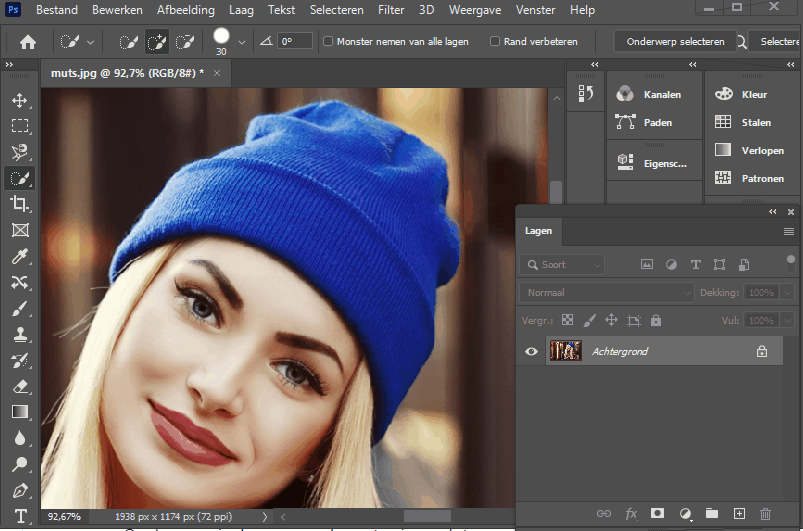

- Vervolgens gaan we de afbeelding gaan we de afbeelding perfectioniseren a.d.h.v. het penseel (zwarte penseel let er ook op dat je de laag masker geselecteerd hebt)

Op deze manier kunnen we elementen in een foto veranderen van kleur.

Er bestaat nog een andere manier om delen van een foto te veranderen van kleur dit kunnen we doen a.d.h.v. de "kleur vervanging penseel" deze is te vinden onder de klassieke penseel (openklapbaar menu).

We kunnen bv. op deze manier het kleur van haar ogen en haar aanpassen.

- Zoom in op haar ogen (gebruik de zoom tool)
- Selecteer de "kleur vervanging penseel"
- Selecteer het gewenste kleur (bv. blauw)
- Schilder nu over de pupil (zoals met het penseel)

herhalingstips:

- druk op "H" om met de hand tool je afbeelding te verplaatsen
- druk op alt + scroll van je muis om in en uit te zoomen (of ctrl + of ctrl -)
- druk op "B" op snel je huidig penseel te selecteren (dat kan de gewone zijn of in dit geval de kleurvervangingspenseel)
 

#### Oefening
zoek zelf een foto en vervang het kleur bij een kledingstuk en geef de ogen andere kleuren. Je mag ook kiezen om andere delen van de persoon een andere kleur te geven.
tip:
- hoge resolutie maakt het makkelijker
- foto's met personen die kleren hebben die makkelijk te onderscheiden zijn van van de rest zal je werk ook vergemakkelijken

dien deze oefening in & geef die oefening als naam "kleur vervanging"

## 2. Handelingen automatiseren

### 2.1 Zelf Handelingen opnemen (record actions)

Photoshop heeft een handige functie waarmee je repetitief werk kan automatiseren. Bijvoorbeeld je moet op 100 foto's

Voor deze oefening gaan we het "Spotify Effect" van les 2 automatiseren.

- Maak een nieuw photoshop bestand (1000px op 600px)
- Voeg de afbeelding kendrick.jpg toe aan het photoshop bestand
- Zet de afbeelding ongeveer in het midden.
- Alle stappen die we vanaf nu volgen kunnen we gaan opnemen om vervolgens te gaan automatiseren (omzetten zwart / wit, contrast verhogen, lagen met opvulkleur toevoegen)
- Om dit te doen gaan we naar Venster (window) > handelingen (actions)
- of alternatief: druk op alt + F9
- Klik vervolgens op nieuwe handeling (new action) maken en geef deze een naam.
- Klik op record

- Doe nu alle handelingen in de juiste volgorde en zorg ervoor dat je geen overbodige handelingen.
- Start met de afbeelding om te zetten in het zwart-wit (via aanpassingslaag > black & white)
- Vervolgens gaan we het contrast verhogen naar 90.

- Maak een nieuwe laag aan en vul deze met de volgende kleur: #fe1467, verander bij opties voor overvloeien (blendingmode) van deze laag naar "multiply".
- Maak nog een nieuwe laag aan en vul deze met de kleur: #23278a, verander de opties voor overvloeien (blendingmode) van deze laag naar "lighten".
- Stop de opname

- Deze handelingen kunnen nu automatisch worden uitgevoerd op een andere afbeelding.
- Maak een nieuw bestand 1000px op 750px en zet de afbeelding gregory.jpg erin
- Ga naar actions en selecteer het "spotify effect" en druk op de play toets

Hieronder de links van dezelfde stappen maar in de Engelse versie van Photoshop:

[Step 1](https://cl.ly/2Z1H0F0b3l3q/Screen%20Recording%202016-12-04%20at%2009.03%20PM.gif)
[Step 2](https://cl.ly/2X2B1B3X2N3g/Screen%20Recording%202016-12-04%20at%2009.16%20PM.gif)
[Step 3](https://cl.ly/2T0J0g1J2b3r/Screen%20Recording%202016-12-04%20at%2009.21%20PM.gif)
[Step 4](https://cl.ly/3t0L2H1c151y/Screen%20Recording%202016-12-04%20at%2009.32%20PM.gif)

### 2.2 Bestaande Photoshop handelingen importeren (actions)

[http://www.creativebloq.com/photoshop/photoshop-actions-912784/4](http://www.creativebloq.com/photoshop/photoshop-actions-912784/4)

[https://graphicriver.net/item/dimension-photoshop-action/18883891?_ga=1.81481299.558594579.1472723420&ref=idsley&ref=idsley&clickthrough_id=846383232&redirect_back=true](https://graphicriver.net/item/dimension-photoshop-action/18883891?_ga=1.81481299.558594579.1472723420&ref=idsley&ref=idsley&clickthrough_id=846383232&redirect_back=true)

- Download een photoshop handeling (actie)
- Dubbelklik op de .atn file om te installeren
- De handeling zou nu beschikbaar moeten zijn via het handelingen paneel (> venster > handelingen of alt+F9)
- Druk op het play icoontje om de handeling toe te passen

## 2.3 Herhalingsoefening: Website in Photoshop maken

Als oefening gaan we een bestaande website in Photoshop namaken.

We maken de eerste pagina klassikaal. Probeer dan 3 pagina's na te maken zelf met alles wat je tot nu toe hebt geleerd

Je kan alle bron bestanden vinden in bron bestanden van vandaag;

 
---

## 3 GIF: Web Animaties in Photoshop maken

### 3.1 GIF Introductie

- Gif staat voor graphics interchange format, dat betrekking heeft op een bestandsformaat dat zowel statische als geanimeerde beelden ondersteunt.
- Gifs zijn snelle, geluidloze video’s die oneindig afspelen in een loop en die geen afspeelknop hebben.
- Gif is totaal geen nieuw fenomeen, het is ouder dan het internet en ouder dan de meeste mensen die er nu gebruik van maken.
- Afgelopen 15 juni vierde de GIF zijn 30-jarige bestaan! Steve Wilhite, die het in 1987 uitvond als ingenieur voor CompuServe, wist zelf niet eens dat hij er een Lifetime Achievement Webby mee zou winnen.

#### Voorbeelden:

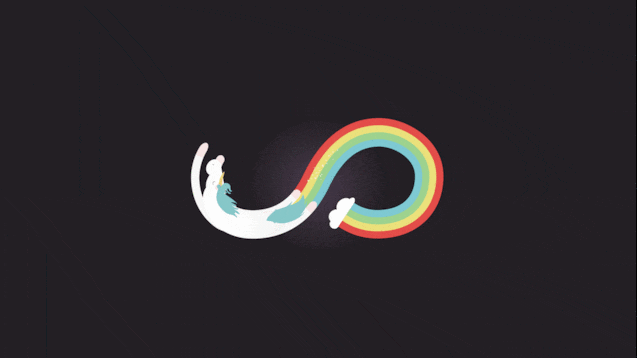
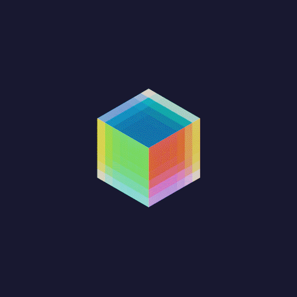
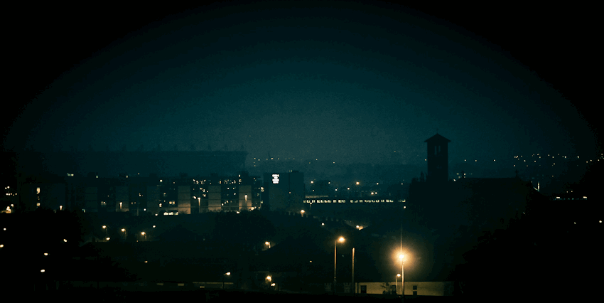
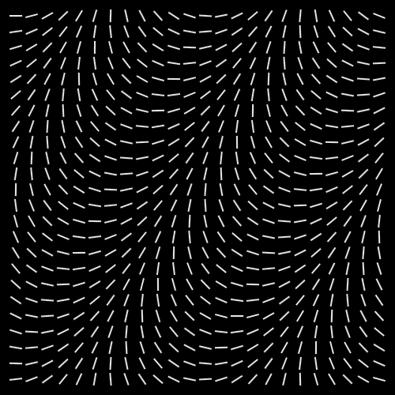

#### Resources:

- [https://giphy.com/](https://giphy.com/) 
- [https://www.gifer.com/](https://www.gifer.com/) 
- je kan natuurlijk op in de meeste zoekmachines zoeken, specifiek voor gifs:

### 3.2 GIF - Oefening: bal botsen aan de hand van Tween

### Tweening

Engelse uitleg: ([wiki (EN)](https://en.wikipedia.org/wiki/Inbetweening))

Inbetweening of tweening is het proces waarbij een geanimeerde afbeelding wordt voorzien van meerdere afbeeldingen per seconde, waardoor het een vloeiendere beeldkwaliteit krijgt.

Het woord komt oorspronkelijk van het Engelse inbetweening wat zoiets betekent als ertussenstoppen.
Oefening als GIF (geschreven instructies kan je eronder vinden)

---

### Oefening

Als oefening gaan we een bal laten botsen.

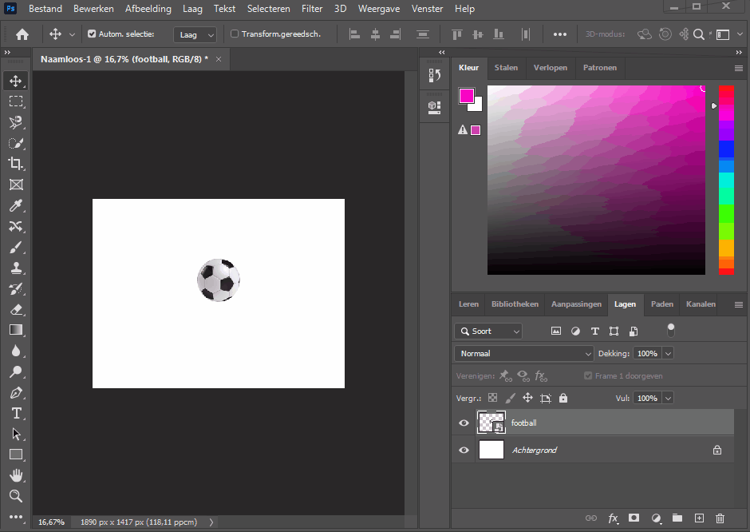

Importeer het bestand football.png (kan je vinden in de bronbestanden van vandaag) of download [hier](football.png)

- Geef alle lagen een relevante naam
- Maak een pixel laag van de bal als je dat wenst
- kies Venster > Tijdslijn
- Kies "Frame Animatie" in de dropdown
- klik op "Frame Animatie" (het ziet er niet uit als een knop, maar je het is wel degelijk een knop, dus druk op de tekst "Frame Animatie")

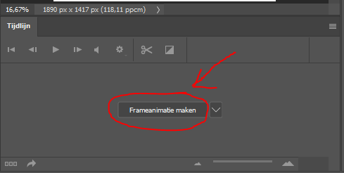

- Kies een begin positie voor de bal (bv. links van boven)
- bij de tijdslijn, klik op "nieuwe frame" dit is hetzelfde icoontje als een nieuwe laag bij het lagen venster dat je al kent (zie screenshot hieronder)

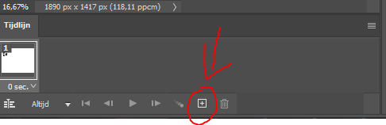

- verzeker je, dat je de 2e frame geselecteerd hebt, en verplaats de bal opnieuw (bv. in het midden vanonder)
- vervolgens, selecteer je beide frames (hou shift in)
- en dan druk je op het Tween icoontje (zie hieronder)

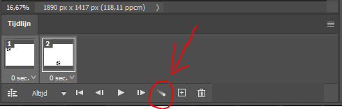

- kies vervolgens de opties hieronder:
- zoals je kan zien, kan je naast positie ook dekking & effecten animeren

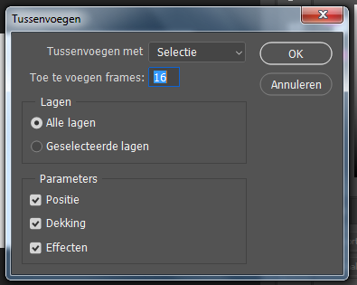

- om op te slaan:
- bestand > exporteren > opslaan voor web (verouderd)
- zorg dat de resolutie niet te groot is (bv 500x500) anders zal het lang duren om het te exporteren
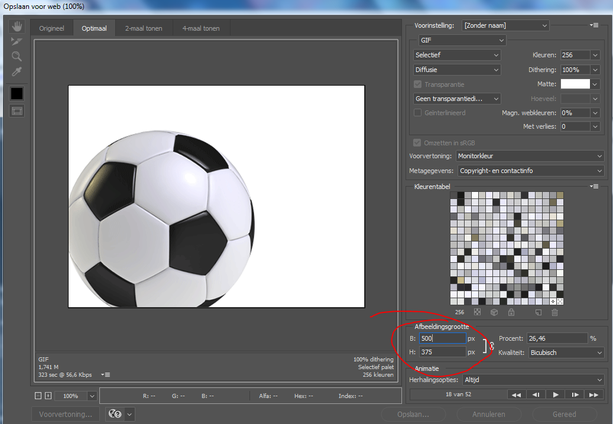

#### opdracht:
Probeer dit nu zelf & naast de positie, probeer ook eens te vinden hoe een effect te animeren (bv blending modes of andere effecten).

### 3.3 GIF - Video tijdslijn

Als we verschillende objecten willen laten bewegen in dezelfde tijd, zal dit moeilijk gaan met de vorige techniek. Om dit te doen, kunnen we gebruik maken van de videotijdslijn (zie het icoontje hieronder om daartoe te komen)

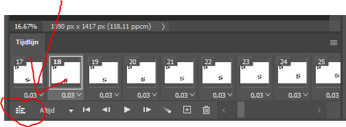

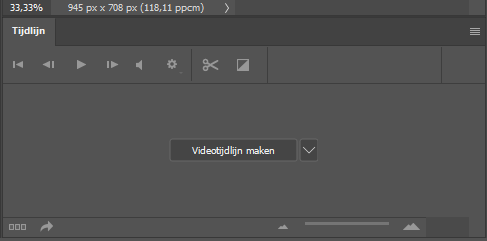

Deze interface komt al dicht bij hoe After Effects werkt.

Ik toon het hier voor 1 laag. Maar als je met een 2e laag werkt blijft het principe hetzelfde.

Hier kan je vervolgens voor elke layer aparte animaties maken.

De oefening hieronder toont hoe we bovenop een video een animatie met tekst kunnen maken.

Je kan de video vinden in de bron bestanden bij de les ( hondje.mp4 )

### 3.4 GIF - Opdracht - Portfolio x 2

Het kan interessant zijn om de werkjes van photoshop die je hebt gemaakt te gebruiken op je portfolio. Een eindresultaat toont niet altijd al het werk dat je er hebt ingestoken.

Een leuke manier om je werk te tonen is er om een GIF van te maken die toont hoe je werk is opgebouwd.

Hopelijk heb je in de meeste opdrachten telkens de originele lagen bewaard!

- Kies een opdracht die je graag op je toekomstige portfolio zou willen gebruiken
- Zet alle lagen op "onzichtbaar" (oog icoontje)
- Kies Venster > Tijdslijn
- Vervolgens kies je een Frame Animatie
- Dan klik je op "nieuwe frame" en ga je de onderste laag zichtbaar maken
- Dan klik je op "nieuwe frame" en ga je de volgende laag zichtbaar maken
- en je herhaalt deze laatste 2 stappen tot je alle frames zichtbaar hebt gemaakt

- speel met de tijd per frame en op die manier kan je een GIF maken die toont hoe je een fotobewerking hebt opgebouwd

- Doe dit voor op zijn minst 2 opdrachten
je hoeft hiervoor niet de .PSD bestanden in te dienen. De GIF bestanden zijn voldoende

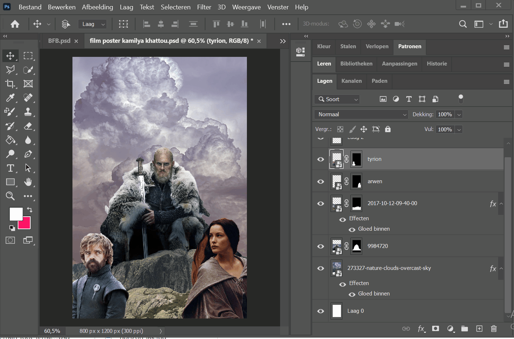

### 3.5 GIF - Opdracht Bewegend Beeld - tegen einde les

- Zoek foto naar keuze (bv een auto in een straat) waarmee je graag zou willen werken - voor je begint, roep mij bij je en laat me weten waarmee je wil werken
- zorg dat je het origineel blijft behouden
- knip iets uit en zorg dat de plaats waar je het onderwerp naar keuze hebt uitgeknipt mooi afgewerkt is. Met andere woorden, dat je niet kan zien dat er daar iets stond: we hebben hier verschillende technieken voor gezien, ga eventueel terug naar les 2 of 3
- vervolgens laat je het onderwerp naar keuze bewegen

#### Extra uitdagingen:
- probeer uit te zoeken hoe je een perfecte loop kan maken;
dat wil zeggen, er voor zorgen de gebruiker niet kan zien wanneer de animatie begint of eindigt (zie voorbeelden hierboven)
- probeer op zijn minst een 2e of 3 objecten te laten bewegen
- gebruik naast positie ook andere animaties (effecten, dekking... etc.)
- denk aan licht / contract / saturatie

#### Hier link naar de les waar we geleerd hebben een object uit de achtergrond te krijgen:
- https://github.com/Goldflow/photoshop-courses/tree/master/les3#31-een-element-uit-een-foto-verwijderen
- https://github.com/Goldflow/photoshop-courses/tree/master/les3#32-snel-retoucheer-penseel-spot-healing-brush-tool

voorbeeld:

