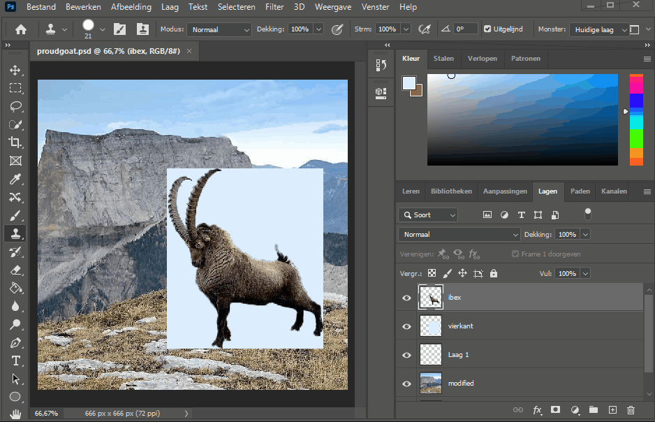
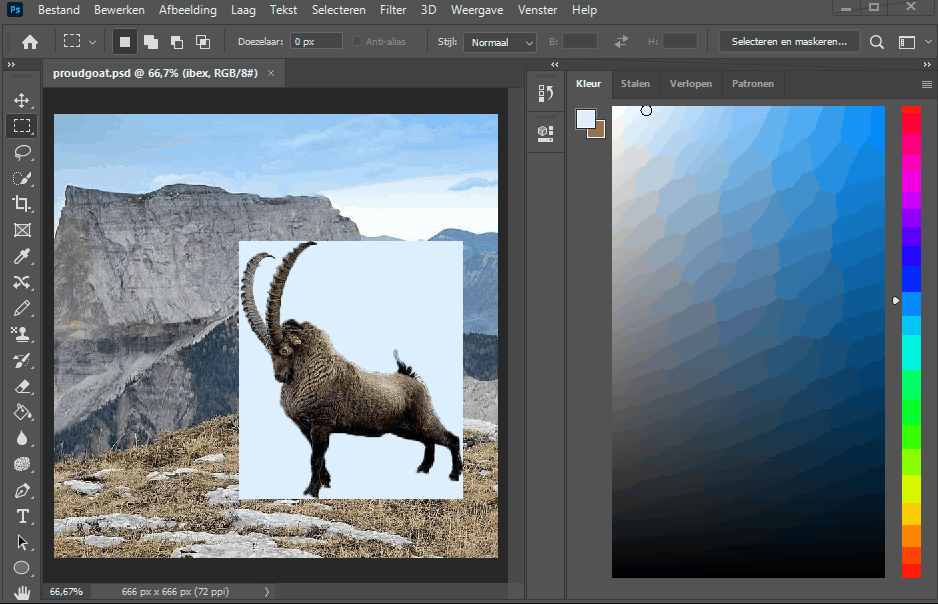
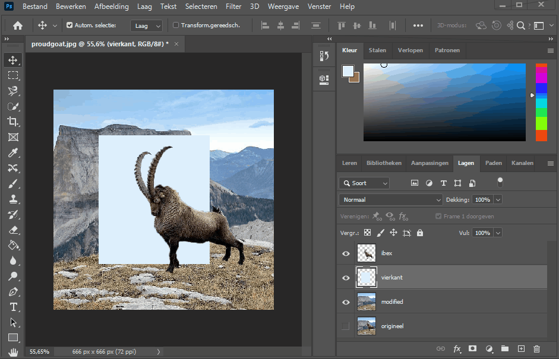
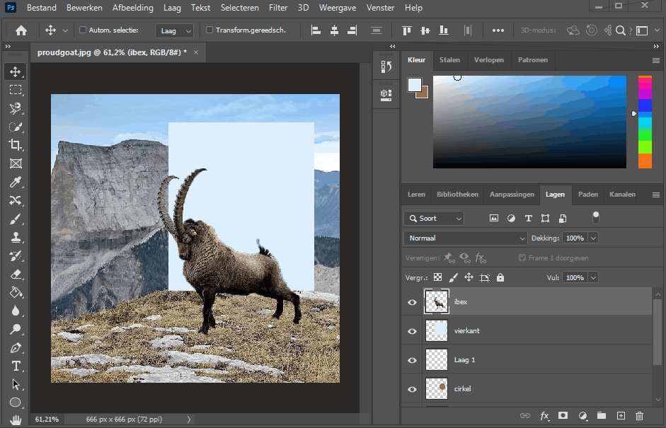
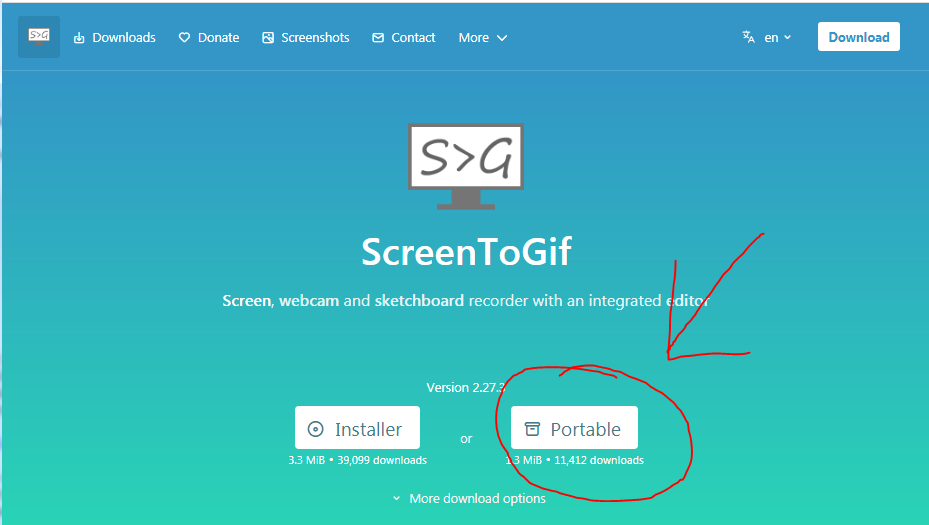
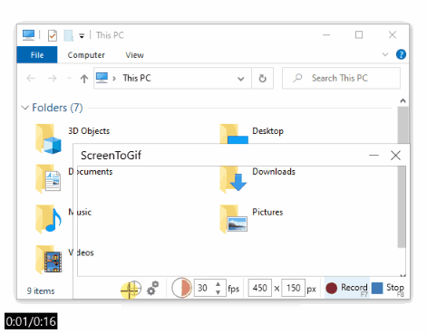

- [Photoshop Les 5](#photoshop-les-5)
  * [1. Reken op jezelf! (self reliance)](#1-reken-op-jezelf---self-reliance-)
    + [1.1 Zelfredzaamheid](#11-zelfredzaamheid)
    + [1.2 Photoshop bied zelf ook heel wat documentatie aan](#12-photoshop-bied-zelf-ook-heel-wat-documentatie-aan)
      - [1.2.1 Lessen bij verschilende tools](#121-lessen-bij-verschilende-tools)
      - [1.2.2 Algemene Photoshop lessen](#122-algemene-photoshop-lessen)
  * [2. Herhaling](#2-herhaling)
    + [2.1 (Verplaatsen) Movetool](#21--verplaatsen--movetool)
    + [2.2 De lasso tool](#22-de-lasso-tool)
      - [2.2.1 De lasso tool](#221-de-lasso-tool)
    + [2.2.2  De Veelhoek Lasso Tool](#222--de-veelhoek-lasso-tool)
    + [2.2.3. De magnetische lasso tool](#223-de-magnetische-lasso-tool)
  * [2.3 Snelle selectie Tool](#23-snelle-selectie-tool)
  * [2.3.1 Snelle selectie (Quick Selectionà Tool](#231-snelle-selectie--quick-selection--tool)
    + [2.3.2 Toverstaf tool (magic wand)](#232-toverstaf-tool--magic-wand-)
  * [2.4 De Pipet (Eyedropper) Tool](#24-de-pipet--eyedropper--tool)
  * [2.5 De Retoucheer Penselen (Healing Brush tools)](#25-de-retoucheer-penselen--healing-brush-tools-)
  * [2.6 Brush Tool](#26-brush-tool)
    + [2.6.1 Brush Tool](#261-brush-tool)
    + [2.6.2 Pencil Tool](#262-pencil-tool)
    + [2.6.3. De kleur vervangen (color replacement) tool](#263-de-kleur-vervangen--color-replacement--tool)
    + [2.6.4 De Mixerpenseel (mixer brush) tool](#264-de-mixerpenseel--mixer-brush--tool)
  * [2.7 Kloonstempel (Clone Stamp Tool)](#27-kloonstempel--clone-stamp-tool-)
    + [2.7.1 Clone Stamp Tool](#271-clone-stamp-tool)
  * [3 OPDRACHT: Instructie Gif](#3-opdracht--instructie-gif)
    + [3.1 Introductie](#31-introductie)
    + [3.2 Opdracht omschrijving](#32-opdracht-omschrijving)
    + [3.3 Hoe een gif op te nemen met ScreenToGif](#33-hoe-een-gif-op-te-nemen-met-screentogif)
  * [4 OPDRACHT: Animal Things](#4-opdracht--animal-things)
  * [5 OPDRACHT: Onverstoord Schaken](#5-opdracht--onverstoord-schaken)
---

# Photoshop Les 5

## 1. Reken op jezelf! (self reliance)

### 1.1 Zelfredzaamheid

In deze module, maar ook in de hele opleiding web design is vindingrijkheid en op jezelf kunnen rekenen heel belangrijk. Elke web developer googlet nog elke dag.
Parate kennis is altijd handig maar bijna nog belangrijker dan de lessen (voor de meeste web design gerelateerde vakken), is leren documentatie opzoeken en die begrijpen belangrijker dan de handelingen van buiten kennen.

Bepaalde handelingen die je uitvoert, ga je vanzelf van buiten kennen na het veel te gebruiken, maar voor andere handelingen is het normaal dat je dat niet meer weet, en dat is niet erg. Maar als je al weet dat iets mogelijk is (bijvoorbeeld met de retoucheer tool), of je weet dat we het in de klas hebben gezien, probeer die informatie dan terug op te zoeken!

Vermoedelijk heb je het intussen al meegemaakt dat je heel lang iets probeert maar dat je eigenlijk niet goed weet hoe, maar toch modder je maar aan. Je moet durven toegeven aan jezelf dat je het niet weet en dan effectief proberen op te zoeken hoe het te doen.

Zie online zoekmachines kan je heel veel informatie vinden als je weet hoe je het moet zoeken. Soms is het gewoon al een goed idee om gewoon je vraag in te typen in de zoekmachine (bv google). Met de vraag, "hoe verklein ik een cirkel in photoshop" kom je zeker al resultaten tegen.

Je moet dus leren je problemen te identificeren en door dan de juiste vraag te stellen kan je tot het juiste antwoord komen.

Dit is enkel waardoor je met tijd en ervaring beter in wordt.

### 1.2 Photoshop bied zelf ook heel wat documentatie aan

#### 1.2.1 Lessen bij verschilende tools
Voor heel wat verschillende werktuigen / tools (niet voor allemaal) in Photoshop kan je lessen volgen in Photoshop zelf!
Dit doe je door met je muis over het icoontje te hangen en enkele seconden te wachten, vervolgens klik je op "Leer het volgende"

Dit kan heel handig zijn om nieuwe werktuigen / tools te ontdekken of een snelle opfrissing te doen.

#### 1.2.2 Algemene Photoshop lessen

Daarnaast is het ook mogelijk om in Photoshop lessen te volgen over zeer uiteenlopende onderwerpen.

Menu > Venster > Leren

## 2. Herhaling

### 2.1 (Verplaatsen) Movetool
De verplaatsings tool vind je helemaal vanboven in het gereedschapspanel (of je kan deze oproepen via de snelkoppeling (shortcut) "v").
Deze tool wordt gebruikt om elementen te verplaatsen.

Een handige functie van de verplaatsings tool is de automatisch selecteren ("auto-select") functie.
Als je dit vinkje aanvinkt dan selecteer je automatisch de juiste laag en moet je niet eerst de juiste laag gaan selecteren in het lagenpanel vooraleer je deze kan bewegen.

Deze functie vind je vanboven in de optiebalk (als je de verplaatsings tool heb geselecteerd).

Via de verplaatsings tool kan je ook items t.o.v. het document (canvas) aligneren
Dit doe je via de aligneer icoontjes vanboven in de optiebalk (uiteraard ook wanneer je de verplaatsings tool geselecteerd hebt).

Je kan dit ook doen tegenover een huidige selectie

### 2.2 De lasso tool

De Lasso tool wordt gebruikt om snel selecties te maken.
De lasso tool is een openklapbaar menu en bestaat uit 3 verschillende soorten lasso tools.

#### 2.2.1 De lasso tool

De klassieke lasso tool kan gebruikt worden om snel een selectie uit de losse hand te maken.

### 2.2.2  De Veelhoek Lasso Tool

De Veelhoek lasso tool wordt gebruikt om geometrische selecties te maken. (In de praktijk heb ik deze tool nog nooit gebruikt...)

### 2.2.3. De magnetische lasso tool

De magnetische lasso tool is zoals de naam zelf zegt magnetisch. D.w.z dat hij automatisch (op basis van contrast) de selectie gaat maken.

Je kan de selectie ook zelf sturen door bv. een punt te verwijderen (via backspace)

## 2.3 Snelle selectie Tool

Is een uitklapbaar menu.

## 2.3.1 Snelle selectie (Quick Selectionà Tool
De Snelle selectie tool is de vierde in de rij van het gereedschapspanel. Deze wordt gebruikt om snel selecties te maken.
Deze is zeer makkelijk te gebruiken je sleept gewoon met de muis over de gebieden die je wilt selecteren.

Je kan de grootte van de selectie tool aanpassen via de optiebalk vanboven (zelfde principe als bij de brush tool).

Als je teveel geselecteerd heb dan is dit geen drama want je kan perfect terug stukken uit de selectie halen dit doe je door de alt-toets ingedrukt te houden en te slepen over de selectie die je weg wilt.

### 2.3.2 Toverstaf tool (magic wand)

De toverstaf tool is een handige tool om selecties te maken van grote uniforme kleuren bijvoorbeeld een achtergrondkleur.

Selecteer de toverstaf tool en klik op het uniform gebied.

Je kan de tolerantie aanpassen vanboven via de optiebalk.

Op deze manier en via inverse selectie kan je makkelijk objecten van de achtergrond halen. Zie voorbeeld hieronder.

## 2.4 De Pipet (Eyedropper) Tool

De 7e in de rij.
Shortcut : i

Met de pipet tool kan je een kleur van een bepaald element gaan nemen en dit vervolgens gaan gebruiken.

Hou de muis ingedrukt en ga over de foto, vervolgens kan je zien dat het kleur van de selector verandert, als je de kleur wil van die plaats, dan laat je de muis los en vervolgens staat dit kleur actief als voorgrondkleur.

Vervolgens kan je meer info (zoals de hexadecimale code) van dit kleur opvragen, dit doe je door dubbel te klikken op het voorgrondkleur.

## 2.5 De Retoucheer Penselen (Healing Brush tools)

De Retoucheer Penselen hebben we uitvoerig besproken in [les 3](https://github.com/goldflow/photoshop-courses/tree/master/les3).
Deze tools worden gebruikt om "storende" elementen zoals elektriciteitskabels, acné, etc. uit foto's te halen.

De healing brush tool werkt zoals een klassieke brush tool en de dikte van de penseel kan dus ook worden aangepast via de optiebalk.

## 2.6 Brush Tool

### 2.6.1 Brush Tool
De Brush tool wordt gebruikt om te "schilderen". Maar wij gaan deze vooral gebruiken in de context van laag masks waarbij we delen van de foto verbergen met zwart en delen terug zichtbaar maken met wit.

De dikte / hardness van de brush tool kan aangepast worden via de optiebalk van boven.

### 2.6.2 Pencil Tool

### 2.6.3. De kleur vervangen (color replacement) tool

De kleur vervangen tool werkt zoals het penseel maar hiermee kan je met een ander kleur over iets schilderen.

We hebben deze tool gebruikt in [les 4](https://github.com/goldflow/photoshop-courses/tree/master/les4).

### 2.6.4 De Mixerpenseel (mixer brush) tool

## 2.7 Kloonstempel (Clone Stamp Tool)

### 2.7.1 Clone Stamp Tool

De clone stamp tool kan gebruikt worden om "onvolmaaktheden" uit een foto te halen. Deze tool is een beetje vergelijkbaar met de "Healing Brush Tool". Alleen moet je hier zelf een referentiepunt aangeven (dit doe je met de alt-toets).

---

## 3 OPDRACHT: Instructie Gif

### 3.1 Introductie

In het volgende hoofdstuk zie je herhalingen van technieken die wel al meerdere keren hebben gezien. 

Wat ik nu zal vragen is een oefening op het leren uitvoeren van instructies. Het is belangrijk in IT in het algemeen maar zeker als toekomstige web designers dat jullie leren documentatie en instructies online op te zoeken en op te volgen.

### 3.2 Opdracht omschrijving

Voor deze les moet je naast deze opdracht, ook de volgende 2 opdrachten indienen (hoofdstuk 4 & 5)

- 4. OPDRACHT: Animal Things [link](https://goldflow.github.io/photoshop-courses/animal-things/)
- 5. OPDRACHT: Onverstoord Schaken [link](https://goldflow.github.io/photoshop-courses/chess-focus/)

Gebruik hiervoor de aangeleerde technieken die we in de vorige lessen hebben gezien. 

Scroll naar beneden om de details van deze opdrachten te zien. Deze opdrachten zijn redelijk geavanceerd en als je die op een goeie manier wil uitvoeren ga je sowieso bepaalde technieken moeten uitvoeren die we nog niet in de les hebben gezien.

**Voor deze opdracht wil ik dat je op zoek gaat naar een techniek die je nog niet hebt gebruikt in de les maar gebruikt hebt bij 1 van de 2 opdrachten en daarvan een gif animatie maakt.**

Vereisten:
- dien 2 zo'n verschillende instructie gifs in
- er is een duidelijk begin en eind resultaat
- beeeeg niet te snel met de muis
- de gif bevat op zijn minst 3 verschillende handelingen
- vermeld bij commentaar/beschrijving bij het indienen eventuele tutorials of website eaar je die handelingen hebt gevonden

Hieronder vind je meer informatie hoe je die gif animatie kan maken.

---

**Upload deze gif in de uploadzone die de naam "Instructie Gif" bevat**

Volgende week bekijken we de resultaten klassikaal.

### 3.3 Hoe een gif op te nemen met ScreenToGif

Download de applicatie ScreenToGif en neem 1 photoshop bewerking op, die gebruikt hebt bij 1 van de 2 bovenstaande opdrachten (4 en 5)

[https://www.screentogif.com/](https://www.screentogif.com/)

---

## 4 OPDRACHT: Animal Things

[link](https://goldflow.github.io/photoshop-courses/animal-things/)

## 5 OPDRACHT: Onverstoord Schaken

[link](https://goldflow.github.io/photoshop-courses/chess-focus/)

---

