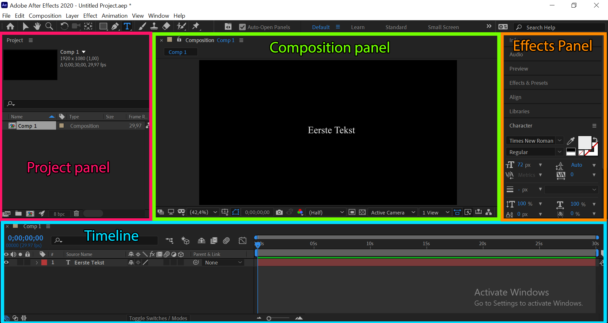

# Les 6: After Effects

## 1. Introductie

### 1.1. Wat is After Effects

#### Kort

"De Photoshop van video editing"

Special effects, motion design & animation.

#### Lang

After Effects wordt in de film- en televisie-industrie gebruikt om special effects, titels en andere objecten aan beeldmateriaal toe te voegen. Alhoewel het mogelijk is, wordt het pure monteren en knippen van beeldmateriaal meestal gedaan in een ander programma.

After Effects maakt net als het Adobe-programma Photoshop gebruik van een "lagensysteem" in combinatie met een tijdlijn. Elke laag bestaat uit beeldmateriaal of effecten. De positie van deze effecten kan exact worden vastgesteld per laag. Zo kan met "keyframes" een effect per frame gepositioneerd en ingesteld worden. De tijdlijn geeft deze instellingen chronologisch weer.

De bediening van het programma werkt voornamelijk via drie panelen, het "Composition"-paneel, het "Project"-paneel en het "Timeline"-paneel (oftewel de tijdlijn waarover eerder werd gesproken). Beeldmateriaal en effecten van buiten het programma zelf worden geïmporteerd in het programma via het "Project"-paneel. Vanuit het "Project"-paneel kan het gewenste beeldmateriaal naar de tijdlijn gesleept worden, waarna er daar effecten aan toegevoegd kunnen worden. Op het "Composition"-paneel wordt weergegeven hoe het beeldmateriaal op de tijdlijn eruitziet, in zijn geheel of per laag.

### 1.2. Wat is After Effects

Wat kan je bijvoorbeeld doen met After Effects?

Zeer veel op vlak van video / beeld manipulatie, maar voor bepaalde taken gebruik je beter externe programma's:

- 3D beelden animeren (dit doe je in een andere programma: Blender of 3DS Max)
- montage van video (dit kan perfect in After Effects maar gaat vlotter in Adobe Premiere)
- vectoriële beelden op een efficiënte manier aanpassen (beter in Illustrator)
- Afbeeldingen / Design / Fotomanipulaties op een efficiënte manier aanpassen (beter in Photoshop)

Om zelf een beter gevoel te krijgen voor motion design is het goed om geregeld bepaalde inspiratie sites te bekijken. Natuurlijk kijken de meeste van ons al vrij veel naar video's dus iedereen heeft automatisch daar al een gevoel voor maar het blijft een goed idee om het kaf van het koren te kunnen onderscheiden.

Inspiratie:

- [https://motionographer.com/](https://motionographer.com/)
- [https://vimeo.com/channels/staffpicks](https://vimeo.com/channels/staffpicks)
- [https://www.behance.net/](https://www.behance.net/)
- [https://abduzeedo.com/](https://abduzeedo.com/)
- [https://www.artofthetitle.com/](https://www.artofthetitle.com/)
- [https://theinspirationgrid.com//](https://theinspirationgrid.com/)
- [https://2017.motionawards.com/winners/](https://2017.motionawards.com/winners/)

Wat maakt een geanimeerde video goed? Probeer geregeld te tijd te nemen om een antwoord voor jezelf te vinden op die vraag.
### 1.3 Enkele begrippen in After Effects

#### Composition (compositie)

Een compositie (composition) kan je het best vergelijken met een soort van PSD bestand gelijkaardig aan Photoshop.  Een compositie heeft een bepaalde resolutie & frames per second. Een compositie bestaat ook uit verschillende lagen.  Die lagen kunnen bestaan uit zowel video materiaal als beelden.

### 1.3. Overzicht After Effects interface

Gelieve onderstaande video te bekijken (gebruik hoofdtelefoon):

[Nederlandstalige overzicht van After Effects](https://www.youtube.com/watch?v=onfbyShe52U)

#### Project panel

Hierin plaats je alle bronbestanden zoals afbeeldingen (png, jpeg, gif, etc.), Photoshop .PSD, Illustrator .AI, video's, geluidsbestanden etc.

Je vind hier ook de compositie (of verschillende composities) terug van je huidig project.

#### Composition panel

Dit is het paneel waarin je de huidige compositie in kan bekijken. Gelijkaardig aan het canvas in Photoshop. Je kan hier ook bewerkingen uitvoeren.

#### Timeline panel

De tijdslijn of timeline panel, is het paneel waarin je kan kiezen welke lagen wanneer zichtbaar zijn. Je kan hier ook verschillende effecten en manipulaties in toepassen.

De timeline panel heeft links een lagen / layer paneel (gelijkaardig aan photoshop) waarin je de verschillende lagen terugvind. Net zoals in photoshop is de bovenste laag de meest zichtbare laag.

In het rechtse gedeelte, zie je over de tijd van je compositie, welke lagen op welk moment zichtbaar zijn.

#### Effects panel

Hierin kan je verschillende effecten en tools selecteren om toe te passen op je gekozen lagen.

#### Stock Video's gratis

[https://www.pexels.com/nl-nl/zoeken/videos](https://www.pexels.com/nl-nl/zoeken/videos)