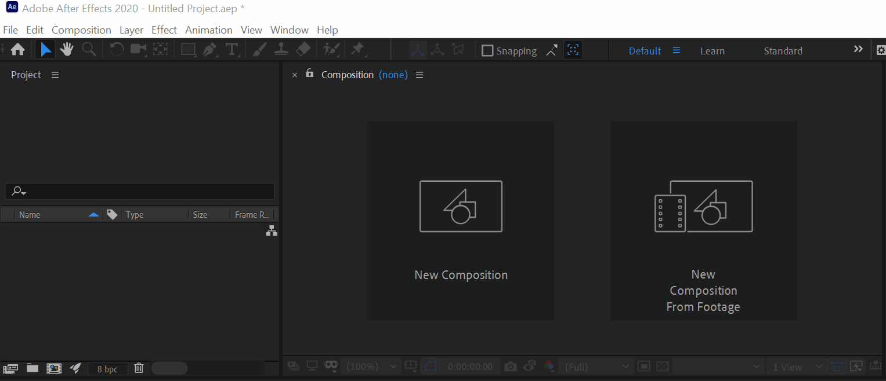

# Les 6: After Effects

## 1. Introductie

### 1.1. Wat is After Effects

#### Kort

"De Photoshop van video editing"

Special effects, motion design & animation.

#### Lang

After Effects wordt in de film- en televisie-industrie gebruikt om special effects, titels en andere objecten aan beeldmateriaal toe te voegen. Alhoewel het mogelijk is, wordt het pure monteren en knippen van beeldmateriaal meestal gedaan in een ander programma.

After Effects maakt net als het Adobe-programma Photoshop gebruik van een "lagensysteem" in combinatie met een tijdlijn. Elke laag bestaat uit beeldmateriaal of effecten. De positie van deze effecten kan exact worden vastgesteld per laag. Zo kan met "keyframes" een effect per frame gepositioneerd en ingesteld worden. De tijdlijn geeft deze instellingen chronologisch weer.

De bediening van het programma werkt voornamelijk via drie panelen, het "Composition"-paneel, het "Project"-paneel en het "Timeline"-paneel (oftewel de tijdlijn waarover eerder werd gesproken). Beeldmateriaal en effecten van buiten het programma zelf worden geïmporteerd in het programma via het "Project"-paneel. Vanuit het "Project"-paneel kan het gewenste beeldmateriaal naar de tijdlijn gesleept worden, waarna er daar effecten aan toegevoegd kunnen worden. Op het "Composition"-paneel wordt weergegeven hoe het beeldmateriaal op de tijdlijn eruitziet, in zijn geheel of per laag.

### 1.2. Wat is After Effects

Wat kan je bijvoorbeeld doen met After Effects?

Zeer veel op vlak van video / beeld manipulatie, maar voor bepaalde taken gebruik je beter externe programma's:

- 3D beelden animeren (dit doe je in een andere programma: Blender of 3DS Max)
- montage van video (dit kan perfect in After Effects maar gaat vlotter in Adobe Premiere)
- vectoriële beelden op een efficiënte manier aanpassen (beter in Illustrator)
- Afbeeldingen / Design / Fotomanipulaties op een efficiënte manier aanpassen (beter in Photoshop)

Om zelf een beter gevoel te krijgen voor motion design is het goed om geregeld bepaalde inspiratie sites te bekijken. Natuurlijk kijken de meeste van ons al vrij veel naar video's dus iedereen heeft automatisch daar al een gevoel voor maar het blijft een goed idee om het kaf van het koren te kunnen onderscheiden.

Inspiratie:

- [https://motionographer.com/](https://motionographer.com/)
- [https://vimeo.com/channels/staffpicks](https://vimeo.com/channels/staffpicks)
- [https://www.behance.net/](https://www.behance.net/)
- [https://abduzeedo.com/](https://abduzeedo.com/)
- [https://www.artofthetitle.com/](https://www.artofthetitle.com/)
- [https://theinspirationgrid.com//](https://theinspirationgrid.com/)
- [https://2017.motionawards.com/winners/](https://2017.motionawards.com/winners/)

Wat maakt een geanimeerde video goed? Probeer geregeld te tijd te nemen om een antwoord voor jezelf te vinden op die vraag.
### 1.3 Enkele begrippen in After Effects

#### Composition (compositie)

Een compositie (composition) kan je het best vergelijken met een soort van PSD bestand gelijkaardig aan Photoshop.  Een compositie heeft een bepaalde resolutie & frames per second. Een compositie bestaat ook uit verschillende lagen.  Die lagen kunnen bestaan uit zowel video materiaal als beelden.

### 1.3. Overzicht After Effects interface

Gelieve onderstaande video te bekijken (gebruik hoofdtelefoon):

[Nederlandstalige overzicht van After Effects](https://www.youtube.com/watch?v=onfbyShe52U)

#### Project panel

Hierin plaats je alle bronbestanden zoals afbeeldingen (png, jpeg, gif, etc.), Photoshop .PSD, Illustrator .AI, video's, geluidsbestanden etc.

Je vind hier ook de compositie (of verschillende composities) terug van je huidig project.

#### Composition panel

Dit is het paneel waarin je de huidige compositie in kan bekijken. Gelijkaardig aan het canvas in Photoshop. Je kan hier ook bewerkingen uitvoeren.

#### Timeline panel

De tijdslijn of timeline panel, is het paneel waarin je kan kiezen welke lagen wanneer zichtbaar zijn. Je kan hier ook verschillende effecten en manipulaties in toepassen.

De timeline panel heeft links een lagen / layer paneel (gelijkaardig aan photoshop) waarin je de verschillende lagen terugvind. Net zoals in photoshop is de bovenste laag de meest zichtbare laag.

In het rechtse gedeelte, zie je over de tijd van je compositie, welke lagen op welk moment zichtbaar zijn.

#### Effects panel

Hierin kan je verschillende effecten en tools selecteren om toe te passen op je gekozen lagen.

### 2. Oefening Basis Animatie

In deze oefening leren we hoe we een basis animatie kunnen maken in After Effects en hoe we verschillende aanpassingen kunnen doen.

We beginnen eerst met een nieuwe compositie te maken.

Op de afbeelding hieronder zie je ze nog allemaal eens op een rijtje:

Belangrijkste instelingen om je compositie te maken

- Width & Height: Breedte & Hoogte, in principe hoeveel pixels breed & hoog je de compositie wil
- Start Timecode: tijdspunt waarop compositie begint, we laten dit op standaardwaarde staan (0:00:00:00 - uren:minuten:seconden:frames)
- Duration: we laten het hier beginnen vanaf 3 seconde, dus 0:00:03:00
- Frame rate (of FPS = Frames per second), staat voor hoeveel frames per seconde er te zien zijn. Hoe hoger, hoe vloeiender. Standaard staat dit rond de 30 maar voor deze oefening zetten we het op 60

We hebben natuurlijk iets nodig om te animeren. We kiezen om te beginnen een basisvorm, met name een vierkant. Een basisvorm noemt een "solid". Hieronder zie 2 manieren om een solid te maken.

Een manier: Layer > New > Solid

Zorg dat je de kleur kiest vooraleer je op confirm drukt.

Eenmaal je layers (lagen) in je layer panel hebt kan je die openklikken om de verschillende eigenschappen te bekijken, maar je kan er ook op zoeken (zie onderstaande gif).

Om een basis animatie te maken, moeten we de "stopwatch" activeren. Dit zorgt ervoor dat er op het gekozen tijdstip een keyframe wordt aangemaakt. Om dan de animatie te vervolledigen moet je het tijdstip verplaatsen en en een aanpassing maken voor de gekozen eigenschap.

In ons geval, gaan we bij het beginpunt de stopwatch drukken, en dan op een later punt (seconde 2) de X coordinaat aanpassen.

Je kan hetzelfde doen om een rotatie te maken door de rotation property aan te passen.

Kan je het verschil zien tussen volgende 2 animaties. Bij de eerste is de animatie zonder easing, dat wel zeggen dat te constant op de zelfde snelheid beweegt.

De 2e afbeelding werd er "easing" toegepast, in de animatie wereld wil dit zeggen dat de snelheid een beetje creatiever wordt gemaakt bv het begin trager te laten bewegen, dan sneller, en dan weer te eindigen met tragere beweging.

Om easing toe te passen selecteer je de 2e keyframes en dan rechterklik je op 1 van 2. Dan kies je "Keyframe Assistant" en dan kies je vervolgens "Easy Ease", experimenteer gerust eens met de andere opties.

### 3. OPDRACHT Squirel titles

In deze opdracht gaan we iets gelijkaardig maken als de Brooklyn 99 intro, maar dan met dieren.

[Brooklyn 99 intro](https://www.youtube.com/watch?v=v0QTdCHX_-c)

Je mag beginnen met de video squirrel.mp4 te downloaden van het bron materiaal voor de les van 2020-10-20.

Vervolgens ga je die importeren op volgende wijze:

Dan maken we een nieuwe compositie door die te slepen in het compositie icoontje:

Vervolgens kiezen gaan we de werkruimte (work area) aanpassen zodat we enkel werken met de eerste 10 seconden. Zoals in de afbeelding kan je het gedeelte waarin je werkt verkleinen naar enkel de tijd die je wil door de balk juist onder de tijdsaanduiding te verkleinen. Dan, wanneer je de gewenste periode hebt gekozen, rechterklik je op die balk en kies je: "Trim Comp to Work Area".

Vervolgens gaan we de frame waarbij we willen dat die stilstaat en Hiervoor selecteren we een frame uit de video. Je kan naar de seconde gaan die je wil; best kies je 1 waar de eekhoorn duidelijk zichtbaar is. Dan klik je op Composition > Save Frame > as Photoshop Layers

Vervolgens begin je de eekhoor uit te knippen in Photoshop.

#### Stock Video's gratis

[https://www.pexels.com/nl-nl/zoeken/videos](https://www.pexels.com/nl-nl/zoeken/videos)

#### Extra Informatie om door te nemen

[The 12 principles of animation](https://www.youtube.com/watch?v=uDqjIdI4bF4)
